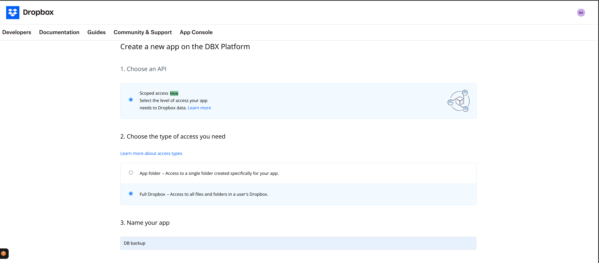
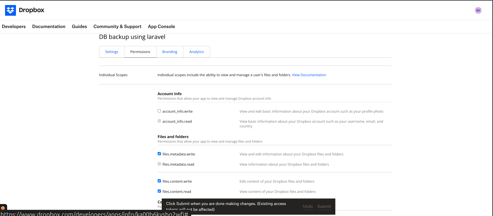

## Moon Hardware

### Database

```bash
php artisan migrate:fresh
php artisan db:seed --force
```

### Run below command in case of directory error

```bash
mkdir -p storage/framework/views
mkdir -p storage/framework/sessions
mkdir -p storage/framework/cache
```

### Databse backup to Dropbox
```bash
php artisan db:backup
```

### Dropbox Setup

1. Create an app in the Dropbox developer console.
    Link: [Dropbox Developer Console](https://www.dropbox.com/developers)

2. How to create an app in Dropbox
    
        - Select "Scoped app", then "Full Dropbox", and enter an app name.
        - Go to the "Permissions" tab and select the `files.content.write` permission, then submit.
        
        - Create a folder named "database-backups" in your Dropbox home page.


### Database backup to external storage
1. Add external storage path to .env file.
2. Run this command: 

```bash
php artisan db:backup-external
```

### create a file and add the below text to it. Save it as database_backup.bat file.

@echo off
cd C:\laravel-project
C:\xampp\php\php.exe artisan migrate --force

Step 2: Create a Task in Task Scheduler

Open Task Scheduler → Create Task.

In General:

Name: Laravel Migration

Run whether user is logged in or not

Check “Run with highest privileges” if needed.

In Triggers:

Add a trigger for the schedule you want (daily, hourly, etc.).

In Actions:

Action: Start a program

Program/script: C:\scripts\migrate.bat

In Conditions:

Uncheck "Start the task only if the computer is on AC power" if you want it to run anytime.

Click OK.